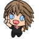
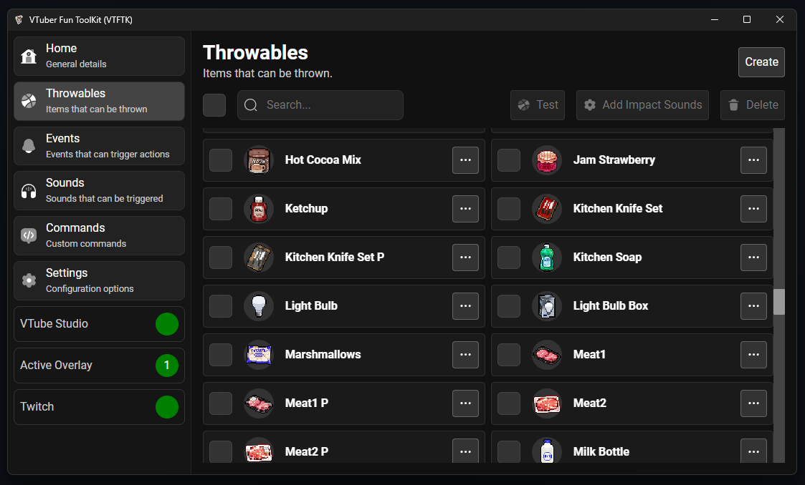
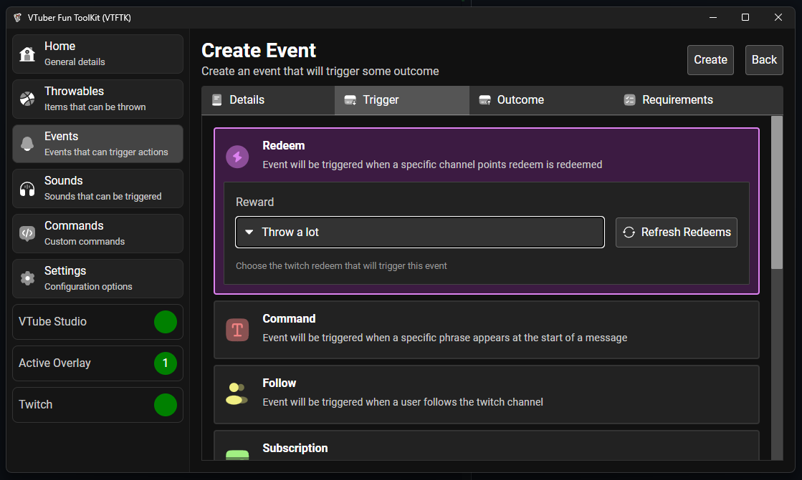
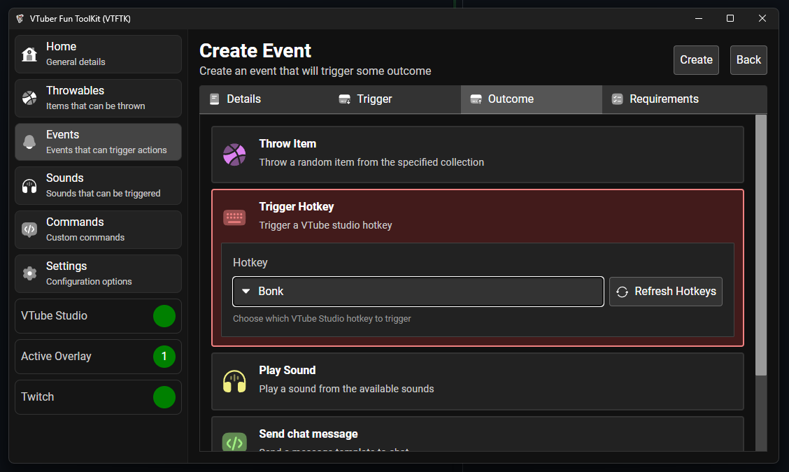
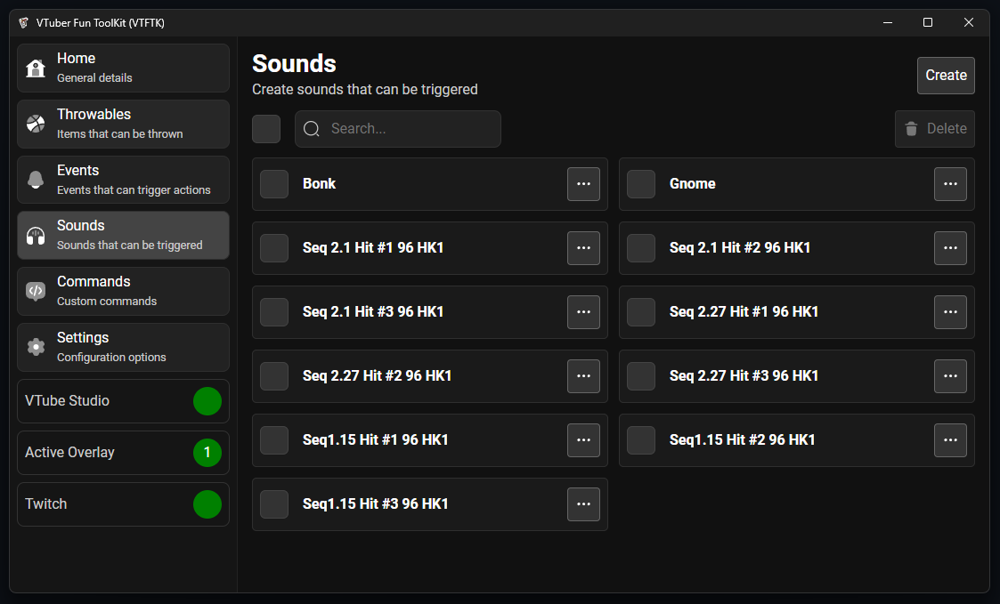
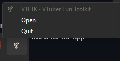

<table>
<tr>
<td> 
</td>
<td>
<h1>VTuber Fun ToolKit (VTFTK - Lite)</h1>

App for VTubers to create interactive experiences with their viewers

<a href="https://vtftk.pages.dev/" target="_blank">Website</a>
</td>
</tr>
</table>

##

<table>
<tr>
<td>

</td>
<td>

Checkout the [Website](https://vtftk.pages.dev/) for guides and setup instructions, examples, and documentation

</td>
</tr>
</table>    

> This is the lite version, this version doesn't include scripting or custom commands just the VTuber bonking functionality you can find the fully featured [Here](https://github.com/vtftk/app)

## 🎯 Project Overview

This tool allows you to create interactive items that can be thrown at your VTube Studio model, play sounds, trigger VTube Studio hotkeys.

Inspired by [KBonk](https://github.com/typeou/karasubonk), this project aims to provide a more tailored and enhanced experience, better suited to my specific needs, preferences, and implementing features that I make use of.

## ⚡ Events

**VTFTK** has a powerful event system that lets you react to "triggers" and produce an "outcome" for various things.

**Triggers:** You can react to these things:  
- 🎉 **Channel Point Redeems** - Run when a channel point redeem is used
- 💬 **Chat Commands** - Run when specific chat commands are used
- ➕ **New Follows** - Run when followers are gained
- ⭐ **Subscriptions** or Gifted Subs - Run when subscriptions are made
- 💎 **Bits Donations** - Run when bits are donated
- 🚀 **Raids** - Run when another Twitch channel raids you
- ⏲️ **Timers** - Run automatically at some fixed time in seconds
- 📢 **Ads Starting** - Run whenever an ad break starts 
- 👋 **Shoutout Received** - Run whenever a shoutout is received

**Outcomes:** You can trigger these:  
- 🪶 Throw items at your avatar  
- 🎛️ Activate VTube Studio hotkeys  
- 🔊 Play custom sounds  
- 💬 Send messages in Twitch chat  

<table>
<tr>
<td>

Triggers

</td>
<td>

    

Outcomes

</td>
</tr>
</table>

## 🔊 Sounds

Play custom sounds for different events, perfect for creating sound alerts! You can also attach sounds to throwable items to play on impact.

## 🧠 Low Resource Usage

The app is built with Rust for efficient performance, and user data is stored in a lightweight SQLite database, ensuring low memory usage.

While the web technologies used for the UI may take up some resources, you can reduce this by closing the VTFTK window. The app will continue running in the background as just the server, removing any unnecessary resource usage from the UI.

You can easily reopen the webview or fully quit VTFTK by clicking the tray menu icon: 

## 🛠️ Built-In Assets

The app includes a collection of pre-configured throwable items from [Pixel Mart](https://ghostpixxells.itch.io/pixel-mart).

Sounds are sourced from [KBonk](https://github.com/typeou/karasubonk) which is originally sourced from [Game Audio GDC](https://sonniss.com/gameaudiogdc) specifically from the [Hong Kong Action Kit Hit Kit 1](http://www.sonniss.com/sound-effects/hong-kong-action-kit-hit-kit-1/) kit

