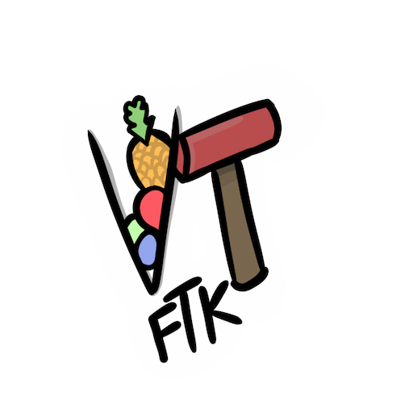
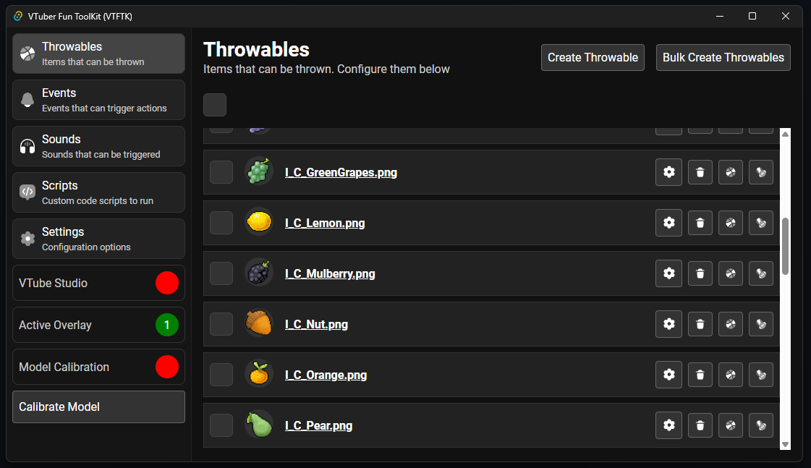
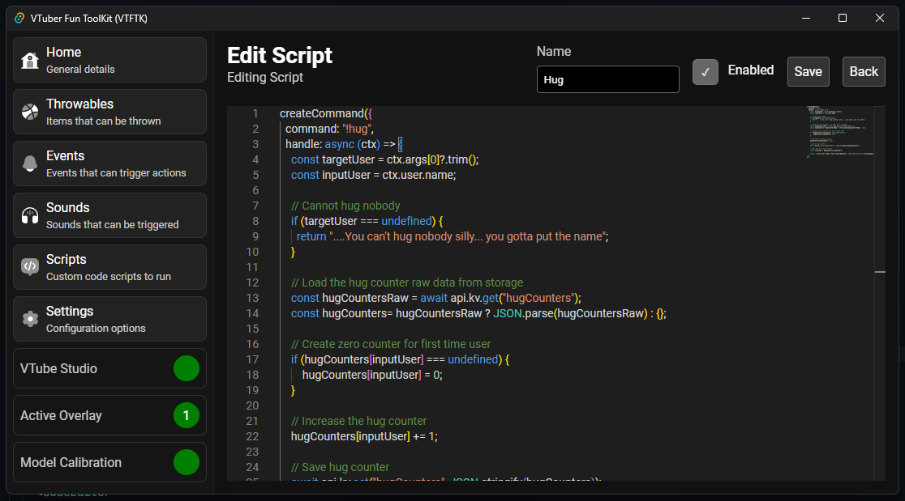
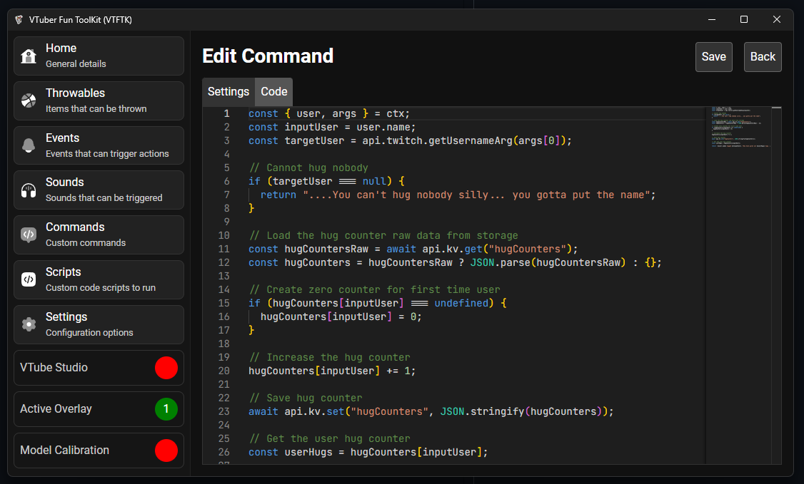
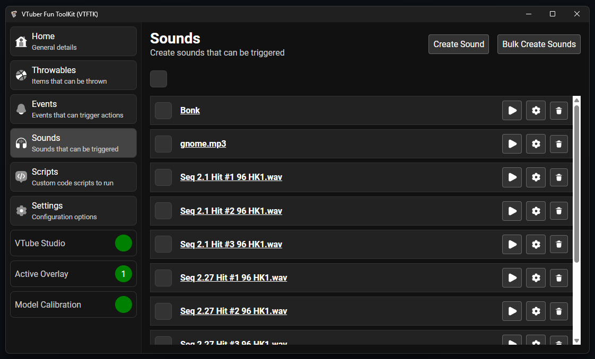

<table>
<tr>
<td> 
</td>
<td>
<h1>VTuber Fun ToolKit (VTFTK)</h1>

<b>WIP</b> App for VTubers to create interactive experiences with their viewers

</td>
</tr>
</table>

## 

Create items that can be thrown at you, sounds that can be played, and trigger VTube studio. All using events from twitch such as redeems, commands, subscriptions, follows, raids, bits

Still early stages and work in progress, but it does work and throwables / sounds can be created then triggered by events.

Aiming to be a tailored and improved version of [KBonk](https://github.com/typeou/karasubonk) more suited to my needs and wants.

## Scripting 

Custom scripting for handling events and creating custom interactive commands

> **NOTE**
> Currently only the "chat" event is exposed along with some APIs for working with persisted key value pairs and some Twitch and HTTP APIs

Built on `deno_core` providing scripting through JavaScript.

## Custom Commands

## Sounds 

Sounds, play custom sounds when events occur. Can be used to create sound alerts. Sounds can also be attached to throwable items to
play the sound upon impact

